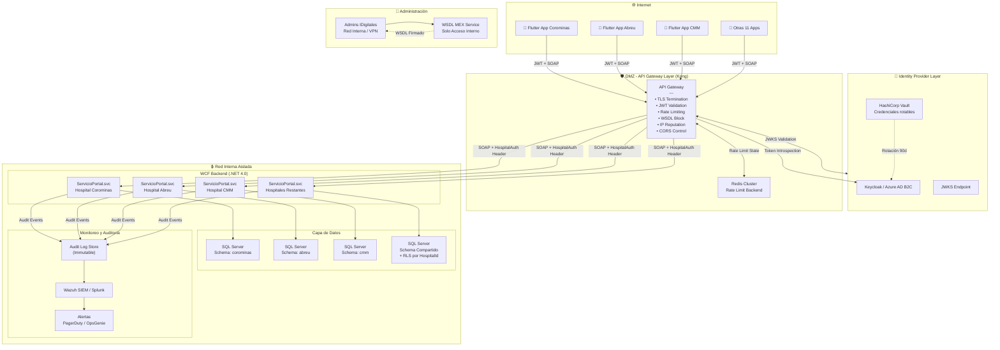
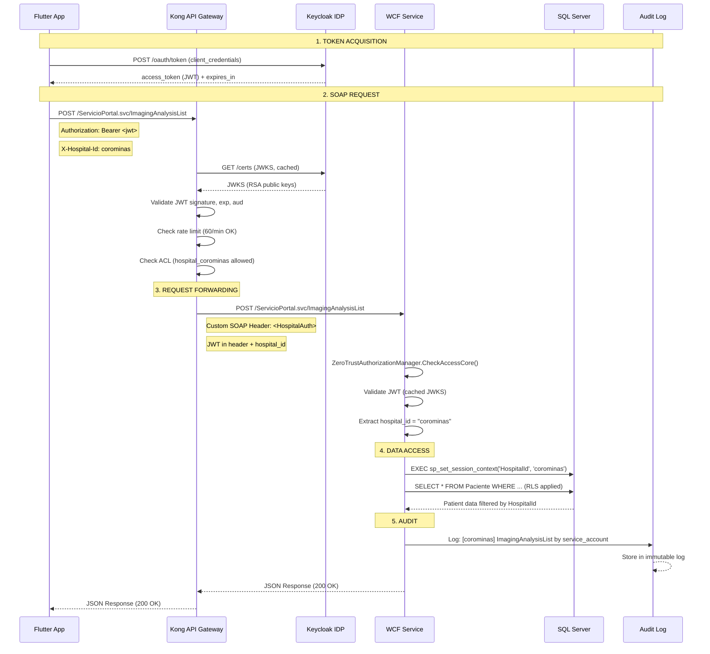

# Zero Trust Security Architecture for CMR Medical Systems / IDigitales WCF Ecosystem

> **Document:** ZTA-CMR-2026-001  
> **Clasificación:** CONFIDENCIAL  
> **Versión:** 1.0 — Julio 2026  
> **Contexto:** Reemplazo del modelo de confianza implícita en WCF (.NET 4.0 SOAP) por arquitectura Zero Trust  
> **Basado en:** NSI-SA-2026-005 (14 hallazgos, 4 críticos, 6,078 PII expuestos)

---

## Tabla de Contenidos

1. [Resumen Ejecutivo](#1-resumen-ejecutivo)
2. [Principios Zero Trust Aplicados](#2-principios-zero-trust-aplicados)
3. [Arquitectura Objetivo](#3-arquitectura-objetivo)
4. [Componente 1: JWT/OAuth2 para Endpoints SOAP](#4-componente-1-jwtoauth2-para-endpoints-soap)
5. [Componente 2: API Gateway con Rate Limiting](#5-componente-2-api-gateway-con-rate-limiting)
6. [Componente 3: Aislamiento de Credenciales por Hospital](#6-componente-3-aislamiento-de-credenciales-por-hospital)
7. [Componente 4: Protección WSDL](#7-componente-4-protección-wsdl)
8. [Diagrama de Arquitectura](#8-diagrama-de-arquitectura)
9. [Flujo de Autenticación](#9-flujo-de-autenticación)
10. [Plan de Implementación por Fases](#10-plan-de-implementación-por-fases)
11. [Estimación de Costos y Esfuerzo](#11-estimación-de-costos-y-esfuerzo)
12. [Monitoreo y Auditoría](#12-monitoreo-y-auditoría)

---

## 1. Resumen Ejecutivo

### Situación Actual (Estado Pre-Zero Trust)

```
┌──────────────┐     ┌──────────────────┐     ┌──────────────┐
│  Flutter App │────▶│  WCF - IIS 10.0  │────▶│  SQL Server  │
│  (14 apps)   │     │  Sin auth en     │     │  (compartido) │
│              │     │  ~1,000 ops SOAP  │     │              │
│              │     │  Contraseña única │     │              │
│              │     │  cmrservice05     │     │              │
│              │     │  WSDL público     │     │              │
│              │     │  debugMode: true  │     │              │
│              │     │  CORS: *          │     │              │
└──────────────┘     └──────────────────┘     └──────────────┘
```

### Problemas Identificados (NSI-SA-2026-005)

| # | Problema | Severidad | Endpoints Afectados |
|---|----------|-----------|---------------------|
| 1 | Sin autenticación en endpoints críticos | 🔴 CRÍTICO | GetContrasenaTabletas, PersonalRecuperar, ImagingAnalysisList |
| 2 | WSDL público sin restricción | 🔴 CRÍTICO | Todos los 9 servidores |
| 3 | Contraseña compartida `cmrservice05` | 🔴 CRÍTICO | Todos los hospitales |
| 4 | Sin rate limiting | 🟠 ALTO | Todos los endpoints |
| 5 | CORS permisivo (`*` + credentials) | 🟡 MEDIO | Múltiples hosts |
| 6 | debugMode en producción | 🟡 MEDIO | 10 de 14 apps |

### Principios de la Arquitectura Propuesta

1. **Nunca confiar, siempre verificar** — Cada petición SOAP debe ser autenticada y autorizada explícitamente
2. **Acceso con mínimo privilegio** — Cada hospital solo accede a sus propios datos
3. **Segmentación por hospital** — Credenciales, tokens y sesiones aisladas por entidad
4. **Protección de metadata** — WSDL solo accesible desde redes autorizadas
5. **Registro y auditoría** — Cada operación SOAP queda registrada con identidad y contexto

---

## 2. Principios Zero Trust Aplicados

### 2.1 Never Trust, Always Verify

| Principio NIST 800-207 | Implementación en este diseño |
|------------------------|-------------------------------|
| Toda fuente de solicitud es no confiable | Todo endpoint SOAP requiere JWT válido — no hay "endpoints internos" sin auth |
| Acceso con mínimo privilegio | Cada hospital tiene un Client ID + scope único; no puede ver datos de otros hospitales |
| Autenticación y autorización en cada solicitud | JWT validado en cada llamada SOAP vía WCF `ServiceAuthorizationManager` |
| Monitoreo continuo | Todos los accesos pasan por API Gateway con logging centralizado |
| Dinámico, no estático | Revocación de tokens por hospital sin afectar a otros |
| Recursos protegidos independientemente del origen | WSDL protegido, endpoints internos autenticados, DB segmentada |

### 2.2 Mapeo a Hallazgos del Reporte

| Hallazgo | Principio ZTA | Componente que lo resuelve |
|----------|---------------|---------------------------|
| CMR-01: Contraseña compartida | Mínimo privilegio + segmentación | Aislamiento por hospital + JWT |
| CMR-02: PersonalRecuperar | Always verify | JWT/OAuth2 en endpoints SOAP |
| CMR-03: WSDL público | Proteger metadata | WSDL protection + API Gateway |
| CMR-04: ImagingAnalysisList | Always verify | JWT/OAuth2 en endpoints SOAP |
| CMR-06: Firma sin auth | Always verify + Non-repudiation | JWT + firma digital en SOAP headers |
| CMR-07: Password enumeration | Rate limiting | API Gateway rate limiting |
| CMR-12: CORS permisivo | Verificar origen | API Gateway validación de origin |

---

## 3. Arquitectura Objetivo

### 3.1 Vista General

```
                    INTERNET                        DMZ                              RED INTERNA
              ┌──────────────────┐     ┌──────────────────────────────┐     ┌──────────────────────────────┐
              │                  │     │                              │     │                              │
              │   Flutter Apps   │     │     API GATEWAY (Kong/Ocelot)│     │     WCF BACKEND (.NET 4.0)   │
              │   (14 apps)      │────▶│  ┌────────────────────────┐  │────▶│  ┌────────────────────────┐  │
              │                  │     │  │• TLS Termination       │  │     │  │• ServiceAuthorization  │  │
              │  ┌─────────────┐ │     │  │• JWT Validation        │  │     │  │  Manager (JWT)         │  │
              │  │• Auth0/IDP │ │     │  │• Rate Limiting          │  │     │  │• Per-Hospital Identity │  │
              │  │• JWT Store │ │     │  │• WSDL Protection        │  │     │  │• SOAP Header Injection │  │
              │  │• Token Mgmt│ │     │  │• IP Reputation          │  │     │  │• Audit Logging         │  │
              │  └─────────────┘ │     │  │• Request Transformation │  │     │  │• Row-Level Security    │  │
              │                  │     │  └────────────────────────┘  │     │  └────────────────────────┘  │
              │   Identity       │     │                              │     │            │                   │
              │   Provider       │     │                              │     │            ▼                   │
              │   (Auth0/Keycloak│     │                              │     │  ┌────────────────────────┐  │
              │    /Azure AD)    │     │                              │     │  │  SQL Server            │  │
              └──────────────────┘     └──────────────────────────────┘     │  │  ┌──────────────────┐  │  │
                                                                           │  │  │• Hospital A DB   │  │  │
                                                                           │  │  │• Hospital B DB   │  │  │
                                                                           │  │  │• Hospital C DB   │  │  │
                                                                           │  │  │• Shared Schema   │  │  │
                                                                           │  │  │  + RLS           │  │  │
                                                                           │  │  └──────────────────┘  │  │
                                                                           │  └────────────────────────┘  │
                                                                           │                              │
                                                                           │  ┌────────────────────────┐  │
                                                                           │  │  Logging & SIEM        │  │
                                                                           │  │  • Wazuh / Splunk      │  │
                                                                           │  │  • Audit Trail         │  │
                                                                           │  │  • Alerting            │  │
                                                                           │  └────────────────────────┘  │
                                                                           └──────────────────────────────┘
```

### 3.2 Stack Tecnológico Propuesto

| Capa | Tecnología | Justificación |
|------|-----------|---------------|
| **Identity Provider** | Keycloak (self-hosted) o Azure AD B2C | OAuth2/OIDC nativo, multi-tenant por hospital |
| **API Gateway** | Kong Gateway (OSS) + WCF Plugin | Rate limiting, JWT validation, SOAP-aware, plugin extensible |
| **WCF Auth** | Custom `ServiceAuthorizationManager` + `UserNamePasswordValidator` | .NET 4.0 compatible, sin necesidad de migrar a .NET Core |
| **Token Formato** | JWT (RFC 7519) con claims `hospital_id`, `role`, `scope` | Stateless, portable, estándar |
| **WSDL Protection** | Kong `acl` plugin + IP whitelist + `httpGetEnabled=false` | Doble capa de protección |
| **Rate Limiting** | Kong `rate-limiting` plugin (redis-backed) | Distribuido, multi-instancia |
| **DB Isolation** | SQL Server schemas separados por hospital + RLS | Aislamiento a nivel de base de datos |
| **Audit Logging** | Wazuh SIEM + Structured WCF Logging | Cumplimiento HIPAA/GDPR |
| **Secrets Management** | HashiCorp Vault | Rotación automática de credenciales por hospital |

---

## 4. Componente 1: JWT/OAuth2 para Endpoints SOAP

### 4.1 Arquitectura de Autenticación

Dado que WCF en .NET Framework 4.0 no tiene soporte nativo para OAuth2/JWT, se implementa un enfoque híbrido:

```
┌──────────┐  1. Auth Request   ┌──────────────┐
│  Flutter │───────────────────▶│  Identity    │
│  App     │◀───────────────────│  Provider    │
│          │  2. JWT Token      │  (Keycloak)  │
└──────────┘                    └──────────────┘
     │                                │
     │ 3. SOAP + JWT (Authorization: Bearer)
     ▼                                │
┌──────────┐                          │
│  API     │  4. Validate JWT w/ JWKS │
│  Gateway │◀─────────────────────────┘
│  (Kong)  │
│          │  5. Inject JWT claims into SOAP header
└──────────┘
     │
     │ 6. SOAP + Custom Header <HospitalAuth>
     ▼
┌──────────────┐
│  WCF Service │  7. Extract HospitalAuth header
│  (.NET 4.0)  │  8. Validate against local cache
└──────────────┘
     │
     ▼
┌──────────────┐
│  SQL Server  │  9. Query with hospital_id filter
└──────────────┘
```

### 4.2 Implementación en WCF (.NET 4.0)

#### 4.2.1 Custom ServiceAuthorizationManager

```csharp
// ZeroTrustAuthorizationManager.cs
public class ZeroTrustAuthorizationManager : ServiceAuthorizationManager
{
    protected override bool CheckAccessCore(OperationContext operationContext)
    {
        var request = operationContext.RequestContext.RequestMessage;
        int httpPosition = request.Headers.FindHeader("HospitalAuth", "http://idigitales/zerotrust");
        
        if (httpPosition < 0)
            return false; // No auth header → deny
            
        var authHeader = request.Headers.GetHeader<HospitalAuthHeader>(httpPosition);
        
        // Validate JWT from header (cached JWKS validation)
        var validator = new JwtValidator();
        var principal = validator.ValidateToken(authHeader.JwtToken);
        
        if (principal == null)
            return false;
            
        // Set thread principal for downstream authorization
        operationContext.ServiceSecurityContext.AuthorizationContext
            .Properties["Principal"] = principal;
            
        // Log access
        AuditLogger.LogAccess(new AuditEntry
        {
            HospitalId = principal.FindFirst("hospital_id").Value,
            UserId = principal.FindFirst(ClaimTypes.Name).Value,
            Operation = operationContext.IncomingMessageHeaders.Action,
            Timestamp = DateTime.UtcNow,
            IpAddress = OperationContext.Current.IncomingMessageProperties
                .RemoteEndpoint.Address
        });
        
        return true;
    }
}
```

#### 4.2.2 Web.config Integration

```xml
<system.serviceModel>
  <services>
    <service name="IDigitales.HIS.Web.Servicios.Portal.ServicioPortal"
             behaviorConfiguration="ZeroTrustBehavior">
      <endpoint address="" binding="webHttpBinding"
                contract="IDigitales.HIS.Web.Servicios.Portal.IServicioPortal" />
    </service>
  </services>
  
  <behaviors>
    <serviceBehaviors>
      <behavior name="ZeroTrustBehavior">
        <serviceAuthorization principalPermissionMode="Custom"
                              serviceAuthorizationManagerType="
                                IDigitales.ZeroTrust.ZeroTrustAuthorizationManager,
                                IDigitales.ZeroTrust" />
        <serviceMetadata httpGetEnabled="false" httpsGetEnabled="false" />
        <serviceDebug includeExceptionDetailInFaults="false" />
      </behavior>
    </serviceBehaviors>
  </behaviors>
</system.serviceModel>
```

#### 4.2.3 Flutter Client Integration

```dart
// In each Flutter app, authentication service
class AuthService {
  final String hospitalId; // From configuration.yaml
  final String clientId;
  final String clientSecret;
  
  Future<String> getAccessToken() async {
    // OAuth2 Client Credentials flow
    final response = await http.post(
      Uri.parse('https://auth.idigitales.com/oauth/token'),
      headers: {'Content-Type': 'application/x-www-form-urlencoded'},
      body: {
        'grant_type': 'client_credentials',
        'client_id': 'hospital_${hospitalId}',
        'client_secret': clientSecret,
        'audience': 'https://wcf.idigitales.com',
      },
    );
    final token = jsonDecode(response.body)['access_token'];
    await _secureStorage.write(key: 'jwt', value: token);
    return token;
  }
  
  Future<Map<String, dynamic>> callSoapEndpoint(
    String method, Map<String, dynamic> params) async {
    final token = await _secureStorage.read(key: 'jwt');
    
    return http.post(
      Uri.parse('https://gateway.idigitales.com/HisWebServicios/Portal/ServicioPortal.svc/$method'),
      headers: {
        'Content-Type': 'application/json',
        'Authorization': 'Bearer $token',
        'X-Hospital-Id': hospitalId,
      },
      body: jsonEncode(params),
    );
  }
}
```

### 4.3 Token Structure

```json
{
  "alg": "RS256",
  "typ": "JWT",
  "kid": "2026-07-key-01"
}
{
  "iss": "https://auth.idigitales.com/",
  "sub": "hospital_corominas_service",
  "aud": "https://wcf.idigitales.com",
  "exp": 1721234567,
  "iat": 1721224567,
  "jti": "a1b2c3d4-e5f6-7890-abcd-ef1234567890",
  "client_id": "hospital_corominas",
  "hospital_id": "corominas",
  "hospital_name": "Clínica Corominas",
  "scope": "pacientes:read imagenologia:read consentimientos:read",
  "role": "service_account",
  "allowed_endpoints": [
    "Paciente",
    "ImagingAnalysisList", 
    "GetConsentimientosLista"
  ]
}
```

### 4.4 JWKS Rotation Policy

- Rotación de claves RSA cada 30 días
- Soporte para 2 keys simultáneas (transición suave)
- Cache de JWKS en API Gateway con TTL de 1 hora
- Invalidación forzada ante compromiso

---

## 5. Componente 2: API Gateway con Rate Limiting

### 5.1 Kong Gateway Configuration

#### 5.1.1 Service Definition

```yaml
_format_version: "3.0"
services:
  - name: wcf-servicioportal
    host: srv-recvoz.cmr.local
    port: 443
    protocol: https
    path: /HisWebServicios/Portal/ServicioPortal.svc
    plugins:
      - name: rate-limiting
        config:
          minute: 60
          hour: 1000
          policy: redis
          redis_host: redis-cluster.internal
          fault_tolerant: false
          redis_database: 0
      - name: jwt
        config:
          claims_to_verify: ["exp", "nbf"]
          key_claim_name: kid
          secret_is_base64: false
          run_on_preflight: false
          uri_param_names: []
      - name: cors
        config:
          origins:
            - "https://*.clinicacorominas.com.do"
            - "https://*.clinicaabreu.com.do"
            - "https://*.cmm.do"
          credentials: true
          methods: ["POST", "GET", "OPTIONS"]
          headers: ["Authorization", "Content-Type", "X-Hospital-Id"]
      - name: acl
        config:
          allow:
            - hospital_corominas
            - hospital_abreu
            - hospital_cmm
          deny: []
      - name: ip-restriction
        config:
          deny: []
          allows: []
      - name: request-transformer
        config:
          add:
            headers:
              - "X-Forwarded-Hospital:{consumer.custom_id}"
      - name: key-auth
        config:
          key_names: ["X-Hospital-Id"]
          hide_credentials: true
          
routes:
  - name: wcf-all-endpoints
    paths:
      - /HisWebServicios/Portal/ServicioPortal.svc
    methods:
      - POST
      - GET
      - OPTIONS
    strip_path: false
    preserve_host: false
    protocols:
      - https
    plugins:
      - name: rate-limiting
        config:
          minute: 60
          hour: 1000
```

#### 5.1.2 Rate Limiting Tiers por Hospital

| Hospital | Endpoints Críticos | Endpoints Lectura | Endpoints Escritura | Burst |
|----------|-------------------|-------------------|--------------------|-------|
| Clínica Corominas | 30/min | 60/min | 10/min | 5 |
| Clínica Abreu | 30/min | 60/min | 10/min | 5 |
| CMM | 30/min | 60/min | 10/min | 5 |
| Cardio Imágenes | 20/min | 40/min | 5/min | 3 |
| CEDISA (Hub) | 50/min | 100/min | 20/min | 10 |

### 5.2 Rate Limiting por Endpoint Específico

```yaml
# Endpoints críticos con rate limiting más agresivo
routes:
  - name: wcf-get-contrasena-tabletas
    paths:
      - /HisWebServicios/Portal/ServicioPortal.svc/GetContrasenaTabletas
    plugins:
      - name: rate-limiting
        config:
          minute: 2  # Extremadamente restrictivo
          policy: redis
  
  - name: wcf-personal-recuperar
    paths:
      - /HisWebServicios/Portal/ServicioPortal.svc/PersonalRecuperar
    plugins:
      - name: rate-limiting
        config:
          minute: 6  # 1 request each 10 seconds max
          policy: redis
          
  - name: wcf-post-consentimientos-firma
    paths:
      - /HisWebServicios/Portal/ServicioPortal.svc/PostConsentimientosFirma
    plugins:
      - name: rate-limiting
        config:
          minute: 3  # Extremadamente restrictivo - consentimientos
          hour: 20
          policy: redis
```

### 5.3 DDoS Protection

```yaml
# Global rate limiting policies
consumers:
  - username: hospital_corominas
    custom_id: "corominas"
    groups: ["hospital_corominas"]
    plugins:
      - name: rate-limiting
        config:
          minute: 60
          hour: 1000
          
  - username: hospital_abreu
    custom_id: "abreu" 
    groups: ["hospital_abreu"]
    plugins:
      - name: rate-limiting
        config:
          minute: 60
          hour: 1000

# Global DDoS mitigation via Kong
plugins:
  - name: request-size-limiting
    config:
      allowed_payload_size: 10  # 10MB max per request
      
  - name: bot-detection
    config:
      allow: []
      deny:
        - "Go-http-client"
        - "Python-urllib"
        - "curl"
```

---

## 6. Componente 3: Aislamiento de Credenciales por Hospital

### 6.1 Modelo de Identidad Multi-Tenant

Cada hospital recibe:
- **Client ID único** en el Identity Provider
- **Client Secret único** (no compartido)
- **JWKS endpoint único** (opcional, por hospital grande)
- **Scope personalizado** que limita acceso solo a sus endpoints autorizados

### 6.2 Base de Datos: Estrategias de Aislamiento

#### Opción A (Recomendada): Schemas Separados por Hospital

```sql
-- Schema por hospital
CREATE SCHEMA corominas AUTHORIZATION dbadmin_corominas;
CREATE SCHEMA abreu AUTHORIZATION dbadmin_abreu;
CREATE SCHEMA cmm AUTHORIZATION dbadmin_cmm;
-- ...

-- Tablas replicadas por schema
CREATE TABLE corominas.Paciente (
    Id INT PRIMARY KEY,
    Nombre NVARCHAR(200),
    Folio NVARCHAR(50),
    Cedula NVARCHAR(20),
    -- HospitalId implícito por schema
);

-- Conexión por hospital en WCF
-- web.config connection string dynamically selected:
-- Data Source=srv-recvoz;Initial Catalog=HIS_Corominas;...
```

#### Opción B: Shared Schema con Row-Level Security (RLS)

```sql
-- Tabla compartida con filtro por hospital
CREATE TABLE dbo.Paciente (
    Id INT PRIMARY KEY,
    HospitalId NVARCHAR(50) NOT NULL,  -- Clave de aislamiento
    Nombre NVARCHAR(200),
    Folio NVARCHAR(50),
    Cedula NVARCHAR(20)
);

-- Security policy
CREATE SECURITY POLICY HospitalIsolationPolicy
ADD FILTER PREDICATE dbo.fn_HospitalAccessPredicate(HospitalId)
ON dbo.Paciente;

CREATE FUNCTION dbo.fn_HospitalAccessPredicate(@HospitalId NVARCHAR(50))
RETURNS TABLE
WITH SCHEMABINDING
AS
RETURN SELECT 1 AS access_result
WHERE @HospitalId = SESSION_CONTEXT(N'HospitalId')
   OR IS_ROLEMEMBER('db_owner') = 1;

-- WCF inyecta hospital_id en contexto de sesión
EXEC sp_set_session_context @key = N'HospitalId', @value = @hospitalId;
```

### 6.3 Rotación Automática de Credenciales

```yaml
# HashiCorp Vault config
path "hospital/*" {
  capabilities = ["read", "list"]
}

# Cada hospital tiene credenciales rotables automáticamente
vault write hospital/corominas/client_secret ttl=90d
vault write hospital/abreu/client_secret ttl=90d
vault write hospital/cmm/client_secret ttl=90d

# CRON job de rotación (cada 90 días)
# 1. Generar nuevo client_secret en Keycloak
# 2. Almacenar en Vault
# 3. Actualizar configuration.yaml en Flutter apps
# 4. Notificar admin hospitalario
```

### 6.4 Configuration.yaml por Hospital

```yaml
# Antes (compartido - INSEGURO)
hospital_id: "corominas"
api_url: "https://portal.clinicacorominas.com.do/HisWebServicios/Portal/ServicioPortal.svc"
password: "cmrservice05"  # ❌ COMPARTIDA

# Después (aislado)
hospital_id: "corominas"
api_url: "https://gateway.idigitales.com/HisWebServicios/Portal/ServicioPortal.svc"
auth_url: "https://auth.idigitales.com/oauth/token"
client_id: "hospital_corominas"
# client_secret: NO VA EN CONFIG - se obtiene vía MDM/keystore
```

---

## 7. Componente 4: Protección WSDL

### 7.1 Estrategia de Defensa en Capas

```
Capa 1: Deshabilitar metadata endpoint
Capa 2: IP Whitelist en IIS
Capa 3: API Gateway block
Capa 4: Kong ACL para consultas WSDL
Capa 5: WSDL firmado digitalmente
Capa 6: Metadata Exchange Service separado
```

### 7.2 Implementación en IIS / web.config

```xml
<!-- DESHABILITAR WSDL PÚBLICO -->
<system.serviceModel>
  <behaviors>
    <serviceBehaviors>
      <behavior name="ProductionBehavior">
        <!-- Deshabilitar completamente metadata HTTP -->
        <serviceMetadata httpGetEnabled="false" 
                         httpsGetEnabled="false" 
                         httpGetUrl="" />
        <serviceDebug includeExceptionDetailInFaults="false" />
      </behavior>
    </serviceBehaviors>
  </behaviors>
  
  <protocolMapping>
    <!-- Forzar HTTPS -->
    <add scheme="http" binding="webHttpBinding" bindingConfiguration="SecureHttp" />
  </protocolMapping>
  <bindings>
    <webHttpBinding>
      <binding name="SecureHttp">
        <security mode="Transport">
          <transport clientCredentialType="None" />
        </security>
      </binding>
    </webHttpBinding>
  </bindings>
</system.serviceModel>

<!-- IIS URL Rewrite - Bloquear ?wsdl -->
<system.webServer>
  <rewrite>
    <rules>
      <rule name="BlockWSDL" stopProcessing="true">
        <match url="(.*)" />
        <conditions>
          <add input="{QUERY_STRING}" pattern="wsdl" ignoreCase="true" />
          <add input="{REMOTE_ADDR}" pattern="^10\.|^172\.(1[6-9]|2[0-9]|3[01])\.|^192\.168\." 
               negate="true" />
        </conditions>
        <action type="CustomResponse" 
                statusCode="403" 
                statusReason="Forbidden" 
                statusDescription="WSDL access restricted" />
      </rule>
    </rules>
  </rewrite>
  
  <!-- Deshabilitar directory listing -->
  <directoryBrowse enabled="false" />
  
  <!-- Ocultar versiones de servidor -->
  <security>
    <requestFiltering>
      <requestLimits maxQueryString="2048" />
      <verbs>
        <add verb="OPTIONS" allowed="true" />
        <add verb="POST" allowed="true" />
        <add verb="GET" allowed="true" />
      </verbs>
    </requestFiltering>
  </security>
</system.webServer>

<!-- Remover headers de versión -->
<system.webServer>
  <httpProtocol>
    <customHeaders>
      <remove name="X-Powered-By" />
      <remove name="X-ASPNET-Version" />
      <remove name="Server" />
    </customHeaders>
  </httpProtocol>
</system.webServer>
```

### 7.3 Kong WSDL Protection Plugin Configuration

```yaml
# Kong route for WSDL access (bloqueado excepto IPs internas)
routes:
  - name: wcf-wsdl-block
    paths:
      - /HisWebServicios/Portal/ServicioPortal.svc
    methods:
      - GET
    plugins:
      - name: ip-restriction
        config:
          allow:
            - "10.0.0.0/8"      # Red interna
            - "172.16.0.0/12"    # Red interna
            - "192.168.0.0/16"   # Red interna
            - "66.98.69.0/24"    # Rango CEDISA (solo admin)
      - name: bot-detection
        config:
          deny:
            - "curl"
            - "wget"
            - "Go-http-client"
            - "python-requests"
            - "PostmanRuntime"
            - "Mozilla/5.0 (compatible; MSIE 6.0)"
```

### 7.4 WSDL Firmado Digitalmente

Para los casos donde el WSDL sea necesario para herramientas de desarrollo internas:

```xml
<!-- Generar WSDL firmado -->
<!-- 1. Exportar WSDL desde entorno de desarrollo -->
<!-- 2. Firmar con certificado interno de IDigitales -->
openssl smime -sign -in ServicioPortal.wsdl \
  -signer idigitales-dev.pem \
  -out ServicioPortal.signed.wsdl
  
<!-- 3. Almacenar en repositorio interno Git -->
<!-- 4. Consumidores autorizados verifican firma -->
openssl smime -verify -in ServicioPortal.signed.wsdl \
  -CAfile idigitales-ca.pem
```

### 7.5 Metadata Exchange (MEX) Alternativo

```xml
<!-- Servicio MEX interno (solo accesible desde VPN) -->
<system.serviceModel>
  <behaviors>
    <serviceBehaviors>
      <behavior name="InternalMexBehavior">
        <serviceMetadata httpGetEnabled="true" 
                         httpGetUrl="http://srv-recvoz.internal:8080/mex" />
        <serviceAuthorization principalPermissionMode="UseWindowsGroups" />
      </behavior>
    </serviceBehaviors>
  </behaviors>
  <services>
    <service name="IDigitales.HIS.Web.Servicios.Portal.MetadataExchangeService"
             behaviorConfiguration="InternalMexBehavior">
      <host>
        <baseAddresses>
          <add baseAddress="http://srv-recvoz.internal:8080" />
        </baseAddresses>
      </host>
    </service>
  </services>
</system.serviceModel>
```

---

## 8. Diagrama de Arquitectura



### 8.1 Flujo de Datos: Llamada SOAP Autenticada

```
Paso 1:  Flutter App solicita JWT a Keycloak
         → POST /oauth/token {client_id, client_secret, grant_type}
         ← 200 {access_token, expires_in, token_type}

Paso 2:  Flutter App envía SOAP request a API Gateway
         → POST /HisWebServicios/Portal/ServicioPortal.svc/ImagingAnalysisList
         → Headers: Authorization: Bearer <jwt>
         → Headers: X-Hospital-Id: corominas
         → Body: {"sBuscar":""}

Paso 3:  Kong Gateway valida JWT (firma, exp, aud, issuer)
         → Consulta JWKS endpoint de Keycloak (caché 1h)
         → Verifica rate limiting (60/min para este hospital)
         → Verifica ACL (consumer: hospital_corominas)
         → Verifica IP origin (no bloqueada)

Paso 4:  Kong transforma request
         → Agrega header X-Forwarded-Hospital: corominas
         → Reenvía a WCF backend interno (srv-recvoz.internal)

Paso 5:  WCF recibe SOAP
         → ZeroTrustAuthorizationManager.CheckAccessCore()
         → Extrae JWT del header Authorization
         → Valida firma (JWKS cacheadas)
         → Extrae hospital_id del JWT

Paso 6:  WCF ejecuta operación
         → Inyecta hospital_id en SQL session context
         → RLS filtra automáticamente los datos
         → Registra auditoría en log

Paso 7:  WCF responde
         → JSON/SOAP response con datos filtrados

Paso 8:  Kong devuelve respuesta al cliente
```

---

## 9. Flujo de Autenticación Detallado

### 9.1 Client Credentials Grant (Service-to-Service)



### 9.2 Token Expiration and Renewal

| Evento | Acción |
|--------|--------|
| Token expira (< 5 min) | App renueva automáticamente vía refresh token |
| Token expira (sin refresh) | App redirige a login de hospital o re-authentica |
| Keycloak revoca token | Siguiente validación JWT falla → app re-authentica |
| Hospital desactivado | Keycloak bloquea client_id → todas las llamadas fallan |
| Compromiso detectado | Keycloak revoca todos los tokens del hospital → rotación inmediata |

---

## 10. Plan de Implementación por Fases

### Fase 0: Crisis Inmediata (48 horas)

| # | Acción | Responsable | Dependencia |
|---|--------|-------------|-------------|
| 0.1 | 🔴 Rotar contraseña `cmrservice05` en TODOS los servidores | SysAdmin | Ninguna |
| 0.2 | 🔴 Deshabilitar `debugMode` en web.config (10 servidores) | SysAdmin | Acceso IIS |
| 0.3 | 🔴 Deshabilitar `serviceMetadata httpGetEnabled` en IIS | SysAdmin | Acceso IIS |
| 0.4 | 🔴 Deshabilitar directory listing en IIS | SysAdmin | Acceso IIS |
| 0.5 | 🔴 Configurar HTTPS en `cmr-apps.com` y `disanjose.ddns.net:99` | SysAdmin + DNS | Certificados SSL |

### Fase 1: API Gateway + Rate Limiting (1-2 semanas)

| # | Acción | Esfuerzo |
|---|--------|----------|
| 1.1 | Desplegar Kong Gateway (VM Docker o bare-metal) | 2 días |
| 1.2 | Configurar Kong Service + Route para WCF backend | 1 día |
| 1.3 | Configurar rate-limiting plugin (minute/hour/redis) | 1 día |
| 1.4 | Configurar CORS restrictivo por origen de hospital | 1 día |
| 1.5 | Configurar request-size-limiting + bot-detection | 0.5 días |
| 1.6 | Migrar DNS de apps Flutter → apuntar a Kong en lugar de directo a IIS | 1 día |
| 1.7 | Pruebas de integración con 1 hospital piloto | 2 días |

### Fase 2: JWT/OAuth2 en WCF (2-3 semanas)

| # | Acción | Esfuerzo |
|---|--------|----------|
| 2.1 | Desplegar Keycloak (o conectar Azure AD B2C) | 2 días |
| 2.2 | Crear Client IDs por hospital (10 clientes) | 1 día |
| 2.3 | Compilar y desplegar `ZeroTrustAuthorizationManager` en WCF | 3 días |
| 2.4 | Modificar Kong JWT plugin para validación JWKS | 1 día |
| 2.5 | Modificar Flutter apps: integración OAuth2 | 3-5 días por app |
| 2.6 | Pruebas con app piloto (Corominas) | 3 días |
| 2.7 | Rollout a todas las apps (14 apps) | 1 semana |

### Fase 3: Aislamiento por Hospital (3-4 semanas)

| # | Acción | Esfuerzo |
|---|--------|----------|
| 3.1 | Auditoría de schemas SQL Server por hospital | 2 días |
| 3.2 | Implementar RLS en tablas compartidas (opción B) o migrar a schemas separados (opción A) | 1-2 semanas |
| 3.3 | Crear service accounts SQL por hospital | 1 día |
| 3.4 | Configurar cadenas de conexión dinámicas en WCF | 2 días |
| 3.5 | Implementar rotación automática con HashiCorp Vault | 3 días |
| 3.6 | Pruebas de aislamiento: hospital A no puede ver datos de hospital B | 2 días |

### Fase 4: Auditoría y Monitoreo (2-3 semanas)

| # | Acción | Esfuerzo |
|---|--------|----------|
| 4.1 | Implementar WCF structured audit logging | 2 días |
| 4.2 | Desplegar Wazuh SIEM o Splunk forwarder | 2 días |
| 4.3 | Configurar dashboards de seguridad | 2 días |
| 4.4 | Configurar alertas (anomalías, rate limit hits, auth failures) | 1 día |
| 4.5 | Prueba de penetración post-implementación | 3 días |

---

## 11. Estimación de Costos y Esfuerzo

### 11.1 Esfuerzo de Desarrollo

| Componente | Backend (.NET) | Frontend (Flutter) | Infraestructura | Total |
|------------|---------------|-------------------|-----------------|-------|
| API Gateway (Kong) | — | — | 3 días | 3 días |
| JWT Auth WCF | 5 días | — | — | 5 días |
| OAuth2 Flutter | — | 8 días | — | 8 días |
| Rate Limiting | — | — | 2 días | 2 días |
| Aislamiento DB | 5 días | — | 3 días | 8 días |
| WSDL Protection | 1 día | — | 1 día | 2 días |
| Audit + SIEM | 2 días | — | 3 días | 5 días |
| Testing | 3 días | 3 días | 2 días | 8 días |
| **Total** | **16 días** | **11 días** | **14 días** | **41 días-hombre** |

### 11.2 Costos de Infraestructura (Mensual)

| Recurso | Proveedor | Costo Estimado/Mes |
|---------|-----------|-------------------|
| Kong Gateway (2 nodos) | Self-hosted en VPS | $60-120 |
| Redis Cluster (3 nodos) | Self-hosted | $30-60 |
| Keycloak (2 nodos) | Self-hosted o Azure App Service | $0-200 |
| HashiCorp Vault (3 nodos) | Self-hosted | $0-100 |
| SIEM (Wazuh) | Self-hosted | $0 (OSS) |
| Certificados SSL | Let's Encrypt / ZeroSSL | $0 |
| **Total Infraestructura** | | **$90-480/mes** |

### 11.3 Cronograma Realista

```
Semana 1-2:  Fase 0 (Crisis) + Fase 1 (API Gateway)
Semana 3-5:  Fase 2 (JWT/OAuth2) - App piloto
Semana 6-8:  Fase 2 (Rollout completo 14 apps)
Semana 9-12: Fase 3 (Aislamiento DB + Vault)
Semana 13-15: Fase 4 (Auditoría + Monitoreo + Pen Test)
```

---

## 12. Monitoreo y Auditoría

### 12.1 Eventos Críticos a Monitorear

| Evento | Severidad | Acción |
|--------|-----------|--------|
| >10 fallos de auth/min desde misma IP | 🔴 CRÍTICA | Bloquear IP temporalmente |
| Rate limit excedido 3+ veces/hora | 🟠 ALTA | Notificar admin hospital |
| Intento de acceso a WSDL desde Internet | 🟠 ALTA | Bloquear + alertar |
| Token JWT inválido (>100/min) | 🟠 ALTA | Posible ataque de fuerza bruta |
| Modificación de web.config | 🔴 CRÍTICA | Rollback automático + alerta |
| Nueva IP conectándose a SQL Server | 🟡 MEDIA | Verificar contra whitelist |
| Rotación de credenciales fallida | 🟡 MEDIA | Notificar equipo DevOps |

### 12.2 Dashboard de Seguridad

```sql
-- Vistas de auditoría en tiempo real
CREATE VIEW vw_AuditDashboard AS
SELECT 
    DATEADD(hour, DATEDIFF(hour, 0, Timestamp), 0) AS Hour,
    HospitalId,
    Operation,
    COUNT(*) AS CallCount,
    COUNT(DISTINCT IpAddress) AS UniqueIPs,
    SUM(CASE WHEN IsAuthenticated = 0 THEN 1 ELSE 0 END) AS UnauthorizedAttempts
FROM AuditLog
WHERE Timestamp >= DATEADD(hour, -24, GETUTCDATE())
GROUP BY DATEADD(hour, DATEDIFF(hour, 0, Timestamp), 0),
         HospitalId, Operation;
         
-- Alerta: Pico de actividad anómala
CREATE PROCEDURE sp_CheckAnomalousActivity
AS
    -- Detectar > 3 desviaciones estándar del promedio
    SELECT HospitalId, Operation, CallCount
    FROM vw_AuditDashboard
    WHERE CallCount > (
        SELECT AVG(CallCount) + 3 * STDEV(CallCount)
        FROM vw_AuditDashboard
        WHERE Hour >= DATEADD(hour, -168, GETUTCDATE())
    );
```

### 12.3 HIPAA Compliance Mapping

| Requisito HIPAA | Implementación |
|-----------------|----------------|
| 164.312(a)(1) - Control de acceso único | JWT por hospital (ya no contraseña compartida) |
| 164.312(a)(3) - Emergency access | Break-glass procedure con Vault + 2FA |
| 164.312(b) - Audit controls | Structured audit logging + Wazuh SIEM |
| 164.312(c)(1) - Integrity | JWT firmado RSA256 evita manipulación |
| 164.312(d) - Person/Entity auth | OAuth2 Client Credentials + MFA opcional |
| 164.312(e)(1) - Transmission security | TLS 1.3 en toda la cadena |
| 164.308(a)(4) - Information access mgmt | RLS por hospital + scopes JWT |

---

## Apéndice A: Configuración de Kong Gateway

### A.1 Docker Compose

```yaml
version: '3.8'
services:
  kong-database:
    image: postgres:15-alpine
    environment:
      POSTGRES_DB: kong
      POSTGRES_USER: kong
      POSTGRES_PASSWORD: ${KONG_PG_PASSWORD}
    volumes:
      - kong-data:/var/lib/postgresql/data
    networks:
      - kong-net
      
  kong-migrations:
    image: kong:3.6-alpine
    command: kong migrations bootstrap
    environment:
      KONG_DATABASE: postgres
      KONG_PG_HOST: kong-database
      KONG_PG_PASSWORD: ${KONG_PG_PASSWORD}
    networks:
      - kong-net
    restart: on-failure
    depends_on:
      - kong-database
      
  kong-gateway:
    image: kong:3.6-alpine
    environment:
      KONG_DATABASE: postgres
      KONG_PG_HOST: kong-database
      KONG_PG_PASSWORD: ${KONG_PG_PASSWORD}
      KONG_PROXY_ACCESS_LOG: /dev/stdout
      KONG_ADMIN_ACCESS_LOG: /dev/stdout
      KONG_PROXY_ERROR_LOG: /dev/stderr
      KONG_ADMIN_ERROR_LOG: /dev/stderr
      KONG_ADMIN_LISTEN: 0.0.0.0:8001
      KONG_PROXY_LISTEN: 0.0.0.0:443 ssl, 0.0.0.0:80
    ports:
      - "443:443"
      - "80:80"
      - "8001:8001"  # Admin API (restringir a VPN)
    volumes:
      - ./kong/certs:/etc/kong/certs
      - ./kong/declarative:/etc/kong/declarative
    networks:
      - kong-net
    depends_on:
      kong-migrations:
        condition: service_completed_successfully
        
  redis:
    image: redis:7-alpine
    command: redis-server --requirepass ${REDIS_PASSWORD}
    volumes:
      - redis-data:/data
    networks:
      - kong-net

volumes:
  kong-data:
  redis-data:

networks:
  kong-net:
    driver: bridge
```

### A.2 Health Check Endpoints

```
# Métricas de seguridad disponibles
GET /metrics → Prometheus metrics (rate limits, auth failures)
GET /health → Kong health status
GET /routes → Rotas configuradas (solo admin)
```

---

## Apéndice B: Flutter SDK Integration

### B.1 Paquete OAuth2 para WCF

```dart
// zero_trust_wcf.dart - SDK de integración OAuth2 para apps Flutter
class ZeroTrustWcfClient {
  final String baseUrl;
  final String authUrl;
  final String clientId;
  final String hospitalId;
  
  ZeroTrustWcfClient({
    required this.baseUrl,
    required this.authUrl,
    required this.clientId,
    required this.hospitalId,
  });
  
  Future<Map<String, dynamic>> call({
    required String method,
    Map<String, dynamic> params = const {},
  }) async {
    // 1. Get or refresh token
    final token = await _getValidToken();
    
    // 2. Make SOAP call via Kong Gateway
    final response = await http.post(
      Uri.parse('$baseUrl/$method'),
      headers: {
        'Content-Type': 'application/json',
        'Authorization': 'Bearer $token',
        'X-Hospital-Id': hospitalId,
      },
      body: jsonEncode(params),
    );
    
    if (response.statusCode == 401) {
      // Token expired/invalid → force refresh
      await _refreshToken();
      return call(method: method, params: params);
    }
    
    if (response.statusCode == 429) {
      throw RateLimitExceededException();
    }
    
    return jsonDecode(response.body);
  }
}
```

---

## Apéndice C: Playbook de Respuesta a Incidentes

### Compromiso de Credenciales

```
1. DETECTAR
   - Alerta de SIEM: múltiples auth failures desde IP inusual
   - O reporte de hospital

2. CONTENER
   - Revocar token actual en Keycloak (afecta solo a 1 hospital)
   - Rotar client_secret inmediatamente
   - Bloquear IP ofensora en Kong

3. ERRADICAR
   - Auditar logs del hospital comprometido
   - Verificar integridad de datos (consultas no autorizadas)

4. RECUPERAR
   - Emitir nuevo client_secret
   - Actualizar Flutter app vía MDM
   - Revisar SIEM por actividad residual

5. LECCIONES
   - Post-mortem en 48 horas
   - Actualizar runbooks
```

---

> **Este documento constituye la F4 (Prevención) del Plan de Remediación del reporte NSI-SA-2026-005.**  
> Se recomienda implementar la Fase 0 (Crisis Inmediata) en simultáneo con la lectura de este documento.
